## __USING TERRAFORM IAC TOOL TO AUTOMATE AWS CLOUD SOLUTION FOR 2 COMPANY WEBSITES - CONTINUATION__

This is a countinuation of [Project-16](https://github.com/dybran/Project-16/blob/main/Project-16.md).

In this Project, we will continue creating the resources for the __AWS__ setup. The resources to be created include:

- 4 Private subnets
- 1 Internet Gateway
- 1 NAT Gateway
- 1 Elastic IP
- 2 Route tables
- IAM roles
- Security Groups
- Target Group for Nginx, WordPress and Tooling
- Certificate from AWS certificate manager
- External Application Load Balancer and Internal Application Load Balancer.
- Launch template for Bastion, Tooling, Nginx and WordPress
- Auto Scaling Group (ASG) for Bastion, Tooling, Nginx and WordPress
- Elastic Filesystem
- Relational Database (RDS)

### __CREATE 4 PRIVATE SUBNETS AND TAGGING__

We will create 4 subnets by updating the __main.tf__ with the following code.

```
# Create private subnets
resource "aws_subnet" "private" {
  count                   = var.preferred_number_of_private_subnets == null ? length(data.aws_availability_zones.available.names) : var.preferred_number_of_private_subnets
  vpc_id                  = aws_vpc.narbyd-vpc.id
  cidr_block              = cidrsubnet(var.vpc_cidr, 8, count.index + 2)
  map_public_ip_on_launch = false
  availability_zone       = data.aws_availability_zones.available.names[count.index]
  tags = {
    Name = "narbyd-private-sub"
  }

}
```
We add the __"+ 2"__ to the code for the __count.index__ in the __private subnets__ so that it doesnt overlap with the __public subnets__ created.

Then update the __vars.tf__ with the following for the __private subnets__ indicating the number of subnts to be created - in our case we need to create __4__ subnets.

```
variable "preferred_number_of_private_subnets" {
  type = 4
  description = "Number of private subnets"
}
```

Now we need to tag our resources and we need the tagging to be __dynamic__. Tagging is a straightforward, but a very powerful concept that helps you manage your resources much more efficiently:

- Resources are much better organized in ‘virtual’ groups
They can be easily filtered and searched from console or programmatically
- Billing team can easily generate reports and determine how much each part of infrastructure costs how much (by department, by type, by environment, etc.)
- You can easily determine resources that are not being used and take actions accordingly
- If there are different teams in the organisation using the same account, tagging can help differentiate who owns which resources.

Update our __main.tf__ code with the following. Each section of the codes for the __private__ and __public__ subnets should be updated with this

```
 tags = merge(
  var.tags,
   {
    Name = format("%s-priv-sub-%s", var.name, count.index)
   },
)
```


Then update the __vars.tf__ with the following

```
variable "tags" {
  description = "A mapping of tags to assign to all resources."
  type        = map(string)
  default     = {}
}
```


And the __terraform.tfvars__ with the __tags__

```
tags = {
  Owner-Email     = "onwuasoanyasc@gmail.com"
  Managed-By      = "Terraform"
  Billing-Account = "939895954199"
}
```


So our codes now looks like this - 

For the __main.tf__

```
provider "aws" {
  region = var.region
}

# Create VPC
resource "aws_vpc" "narbyd-vpc" {
  cidr_block                     = var.vpc_cidr
  enable_dns_support             = var.enable_dns_support
  enable_dns_hostnames           = var.enable_dns_support
  enable_classiclink             = var.enable_classiclink
  enable_classiclink_dns_support = var.enable_classiclink
  tags = {
    Name = "narbyd-VPC"
  }

}

# Get list of availability zones
data "aws_availability_zones" "available" {
  state = "available"
}


# Create public subnets
resource "aws_subnet" "public" {
  count                   = var.preferred_number_of_public_subnets == null ? length(data.aws_availability_zones.available.names) : var.preferred_number_of_public_subnets
  vpc_id                  = aws_vpc.narbyd-vpc.id
  cidr_block              = cidrsubnet(var.vpc_cidr, 8, count.index)
  map_public_ip_on_launch = true
  availability_zone       = data.aws_availability_zones.available.names[count.index]

  tags = merge(
    var.tags,
    {
      Name = format("%s-pub-sub-%s", var.name, count.index)
    },
  )

}

# Create private subnets
resource "aws_subnet" "private" {
  count                   = var.preferred_number_of_private_subnets == null ? length(data.aws_availability_zones.available.names) : var.preferred_number_of_private_subnets
  vpc_id                  = aws_vpc.narbyd-vpc.id
  cidr_block              = cidrsubnet(var.vpc_cidr, 8, count.index + 2)
  map_public_ip_on_launch = false
  availability_zone       = data.aws_availability_zones.available.names[count.index]

  tags = merge(
    var.tags,
    {
      Name = format("%s-pub-sub-%s", var.name, count.index)
    },
  )

}
```

The __%s__ takes the interpolated value of __var.name__ while the second __%s__ takes the value of the __count.index__.

For the __vars.tf__

```
variable "region" {
  default = "us-east-1"
}

variable "vpc_cidr" {
  default = "172.16.0.0/16"
}

variable "enable_dns_support" {
  default = "true"
}

variable "enable_dns_hostnames" {
  default = "true"
}

variable "enable_classiclink" {
  default = "false"
}

variable "enable_classiclink_dns_support" {
  default = "false"
}

variable "preferred_number_of_public_subnets" {
  type = number
  description = "Number of public subnets"
}
variable "preferred_number_of_private_subnets" {
  type = number
  description = "Number of private subnets"
}
variable "tags" {
  description = "A mapping of tags to assign to all resources."
  type        = map(string)
  default     = {}
}


variable "name" {
  type = string
  default = "narbyd"
}


```
For the __terraform.tfvars__

```
region = "us-east-1"

vpc_cidr = "172.16.0.0/16"

enable_dns_support = "true"

enable_dns_hostnames = "true"

enable_classiclink = "false"

enable_classiclink_dns_support = "false"

preferred_number_of_public_subnets = 2

preferred_number_of_private_subnets = 4

tags = {
  Owner-Email     = "onwuasoanyasc@gmail.com"
  Managed-By      = "Terraform"
  Billing-Account = "939895954199"
}
```

Now we run 

`$ terraform init`

`$ terraform validate`

`$ terraform fmt`

`$ terraform plan`


### __Create Internet Gateway__

Create an Internet Gateway in a separate Terraform file __internet_gateway.tf__.

```
resource "aws_internet_gateway" "narbyd-ig" {
  vpc_id = aws_vpc.narbyd-vpc.id

  tags = merge(
    var.tags,
    {
      Name = format("%s-%s", var.name,"IG")
    } 
  )
}
```


### __Create NAT Gateway__

We need to create an Elastic IP for the NAT Gateway before creating the NAT Gateway.

Create a file __natgateway.tf__ and add the following code to create the Elastic IP and the NAT Gateway.

```
resource "aws_eip" "narbyd-nat_eip" {
  vpc        = true
  depends_on = [aws_internet_gateway.narbyd-ig]

  tags = merge(
    var.tags,
    {
      Name = format("%s-EIP", var.name)
    },
  )
}

resource "aws_nat_gateway" "narbyd-nat" {
  allocation_id = aws_eip.narbyd-nat_eip.id
  subnet_id     = element(aws_subnet.public.*.id, 0)
  depends_on    = [aws_internet_gateway.narbyd-ig]

  tags = merge(
    var.tags,
    {
      Name = format("%s-NAT", var.name)
    },
  )
}
```

 The __depends_on__ is used to indicate that the Internet Gateway resource must be available before this should be created. 

### __AWS Routes__

Create a file called __route_tables.tf__ and use it to create routes for both public and private subnets.

```
# create private route table
resource "aws_route_table" "private-rtb" {
  vpc_id = aws_vpc.narbyd-vpc.id

  tags = merge(
    var.tags,
    {
      Name = format("%s-Priv-RT", var.name)
    },
  )
}

# associate all private subnets to the private route table
resource "aws_route_table_association" "private-subnets-assoc" {
  count          = length(aws_subnet.private[*].id)
  subnet_id      = element(aws_subnet.private[*].id, count.index)
  route_table_id = aws_route_table.private-rtb.id
}

# create route table for the public subnets
resource "aws_route_table" "public-rtb" {
  vpc_id = aws_vpc.narbyd-vpc.id

  tags = merge(
    var.tags,
    {
      Name = format("%s-Pub-RT", var.name)
    },
  )
}

# create route for the public route table and attach the internet gateway
resource "aws_route" "public-rtb-route" {
  route_table_id         = aws_route_table.public-rtb.id
  destination_cidr_block = "0.0.0.0/0"
  gateway_id             = aws_internet_gateway.narbyd-ig.id
}

# associate all public subnets to the public route table
resource "aws_route_table_association" "public-subnets-assoc" {
  count          = length(aws_subnet.public[*].id)
  subnet_id      = element(aws_subnet.public[*].id, count.index)
  route_table_id = aws_route_table.public-rtb.id
}
```
Now if you run


`$ terraform validate`

`$ terraform plan`

`$ terraform apply` 


This will add the following resources to AWS in multi-az set up:

- Our vpc
- 2 Public subnets
- 4 Private subnets
- 1 Internet Gateway
- 1 NAT Gateway
- 1 Elastic IP
- 2 Route tables (private and public)


If everything is ok we run 

`$ terraform apply`


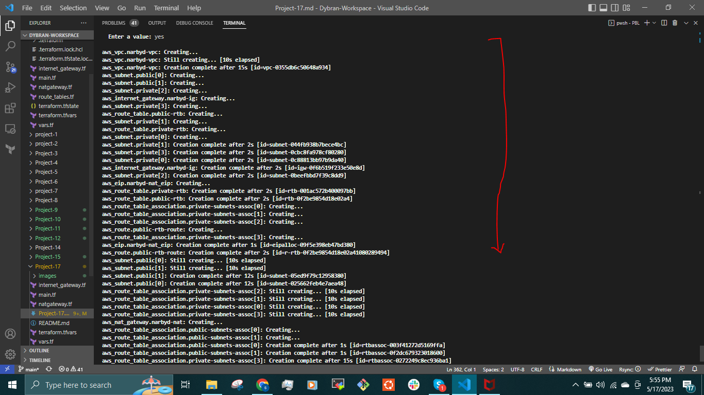


These are some of the resources created


we have created the Networking part of the set up.

let us move on to Compute and Access Control configuration automation using Terraform.

### __AWS Identity and Access Management__

__IAM and Roles__

We want to pass an IAM role our EC2 instances to give them access to some specific resources, so we need to do the following:

__Create AssumeRole__

Assume Role uses __Security Token Service (STS) API__ that returns a set of temporary security credentials that you can use to access AWS resources that you might not normally have access to. These temporary credentials consist of an access key ID, a secret access key, and a security token. Typically, you use AssumeRole within your account or for cross-account access.

Add the following code to a new file named __roles.tf__

```
resource "aws_iam_role" "ec2_instance_role" {
name = "ec2_instance_role"
  assume_role_policy = jsonencode({
    Version = "2012-10-17"
    Statement = [
      {
        Action = "sts:AssumeRole"
        Effect = "Allow"
        Sid    = ""
        Principal = {
          Service = "ec2.amazonaws.com"
        }
      },
    ]
  })

  tags = merge(
    var.tags,
    {
      Name = "aws assume role"
    },
  )
}
```


In this code we are creating __AssumeRole__ with __AssumeRole__ policy. It grants to an entity - in our case it is an EC2, permissions to assume the role.

Create __IAM policy__ for this role.

This is where we need to define a required policy (i.e., permissions) according to our requirements. For example, allowing an IAM role to perform action describe applied to EC2 instances:

```
resource "aws_iam_policy" "policy" {
  name        = "ec2_instance_policy"
  description = "A test policy"
  policy = jsonencode({
    Version = "2012-10-17"
    Statement = [
      {
        Action = [
          "ec2:Describe*",
        ]
        Effect   = "Allow"
        Resource = "*"
      },
    ]

  })

  tags = merge(
    var.tags,
    {
      Name =  "aws assume policy"
    },
  )

}
```

Attach the __Policy__ to the __IAM Role__

This is where, we will be attaching the policy which we created above, to the role we created in the first step.

```
resource "aws_iam_role_policy_attachment" "test-attach" {
  role       = aws_iam_role.ec2_instance_role.name
  policy_arn = aws_iam_policy.policy.arn
}
```

Create an __Instance Profile___ and interpolate the __IAM Role__

```
resource "aws_iam_instance_profile" "ip" {
  name = "aws_instance_profile_test"
  role =  aws_iam_role.ec2_instance_role.name
}
```
### __CREATE SECURITY GROUPS__

Create a file and name it __secgrp.tf__, copy and paste the code below

```
# security group for alb, to allow acess from any where for HTTP and HTTPS traffic
resource "aws_security_group" "ext-alb-sg" {
  name        = "ext-alb-sg"
  vpc_id      = aws_vpc.narbyd-vpc.id
  description = "Allow TLS inbound traffic"

  ingress {
    description = "HTTP"
    from_port   = 80
    to_port     = 80
    protocol    = "tcp"
    cidr_blocks = ["0.0.0.0/0"]
  }

  ingress {
    description = "HTTPS"
    from_port   = 22
    to_port     = 22
    protocol    = "tcp"
    cidr_blocks = ["0.0.0.0/0"]
  }

  egress {
    from_port   = 0
    to_port     = 0
    protocol    = "-1"
    cidr_blocks = ["0.0.0.0/0"]
  }

  tags = merge(
    var.tags,
    {
      Name = "narbyd-ext-ALB-SG"
    },
  )

}


# security group for bastion, to allow access into the bastion host
resource "aws_security_group" "bastion_sg" {
  name        = "vpc_web_sg"
  vpc_id = aws_vpc.narbyd-vpc.id
  description = "Allow incoming HTTP connections."

  ingress {
    description = "SSH"
    from_port   = 22
    to_port     = 22
    protocol    = "tcp"
    cidr_blocks = ["0.0.0.0/0"]
  }

  egress {
    from_port   = 0
    to_port     = 0
    protocol    = "-1"
    cidr_blocks = ["0.0.0.0/0"]
  }

   tags = merge(
    var.tags,
    {
      Name = "narbyd-Bastion-SG"
    },
  )
}

#security group for nginx reverse proxy, to allow access only from the external load balancer and bastion instance
resource "aws_security_group" "nginx-sg" {
  name   = "nginx-sg"
  vpc_id = aws_vpc.narbyd-vpc.id

  egress {
    from_port   = 0
    to_port     = 0
    protocol    = "-1"
    cidr_blocks = ["0.0.0.0/0"]
  }

   tags = merge(
    var.tags,
    {
      Name = "narbyd-nginx-SG"
    },
  )
}

resource "aws_security_group_rule" "inbound-nginx-http" {
  type                     = "ingress"
  from_port                = 443
  to_port                  = 443
  protocol                 = "tcp"
  source_security_group_id = aws_security_group.ext-alb-sg.id
  security_group_id        = aws_security_group.nginx-sg.id
}

resource "aws_security_group_rule" "inbound-bastion-ssh" {
  type                     = "ingress"
  from_port                = 22
  to_port                  = 22
  protocol                 = "tcp"
  source_security_group_id = aws_security_group.bastion_sg.id
  security_group_id        = aws_security_group.nginx-sg.id
}

# security group for internal ALB, to have access only from nginx reverser proxy server
resource "aws_security_group" "int-alb-sg" {
  name   = "my-alb-sg"
  vpc_id = aws_vpc.narbyd-vpc.id

  egress {
    from_port   = 0
    to_port     = 0
    protocol    = "-1"
    cidr_blocks = ["0.0.0.0/0"]
  }

  tags = merge(
    var.tags,
    {
      Name = "narbyd-int-ALB-SG"
    },
  )

}

resource "aws_security_group_rule" "inbound-ialb-https" {
  type                     = "ingress"
  from_port                = 443
  to_port                  = 443
  protocol                 = "tcp"
  source_security_group_id = aws_security_group.nginx-sg.id
  security_group_id        = aws_security_group.int-alb-sg.id
}

# security group for webservers, to have access only from the internal load balancer and bastion instance
resource "aws_security_group" "webserver-sg" {
  name   = "ASG-sg"
  vpc_id = aws_vpc.narbyd-vpc.id

  egress {
    from_port   = 0
    to_port     = 0
    protocol    = "-1"
    cidr_blocks = ["0.0.0.0/0"]
  }

  tags = merge(
    var.tags,
    {
      Name = "narbyd-webserver-SG"
    },
  )

}

resource "aws_security_group_rule" "inbound-web-https" {
  type                     = "ingress"
  from_port                = 443
  to_port                  = 443
  protocol                 = "tcp"
  source_security_group_id = aws_security_group.int-alb-sg.id
  security_group_id        = aws_security_group.webserver-sg.id
}

resource "aws_security_group_rule" "inbound-web-ssh" {
  type                     = "ingress"
  from_port                = 22
  to_port                  = 22
  protocol                 = "tcp"
  source_security_group_id = aws_security_group.bastion_sg.id
  security_group_id        = aws_security_group.webserver-sg.id
}

# security group for datalayer to allow traffic from websever on nfs and mysql port and bastion host on mysql port
resource "aws_security_group" "datalayer-sg" {
  name   = "datalayer-sg"
  vpc_id = aws_vpc.narbyd-vpc.id

  egress {
    from_port   = 0
    to_port     = 0
    protocol    = "-1"
    cidr_blocks = ["0.0.0.0/0"]
  }

 tags = merge(
    var.tags,
    {
      Name = "narbyd-datalayer-SG"
    },
  )
}

resource "aws_security_group_rule" "inbound-nfs-port" {
  type                     = "ingress"
  from_port                = 2049
  to_port                  = 2049
  protocol                 = "tcp"
  source_security_group_id = aws_security_group.webserver-sg.id
  security_group_id        = aws_security_group.datalayer-sg.id
}

resource "aws_security_group_rule" "inbound-mysql-bastion" {
  type                     = "ingress"
  from_port                = 3306
  to_port                  = 3306
  protocol                 = "tcp"
  source_security_group_id = aws_security_group.bastion_sg.id
  security_group_id        = aws_security_group.datalayer-sg.id
}

resource "aws_security_group_rule" "inbound-mysql-webserver" {
  type                     = "ingress"
  from_port                = 3306
  to_port                  = 3306
  protocol                 = "tcp"
  source_security_group_id = aws_security_group.webserver-sg.id
  security_group_id        = aws_security_group.datalayer-sg.id
}
```
We use the __aws_security_group_rule__ to refrence another security group in a security group.

### __CREATE CERTIFICATE FROM AMAZON CERTIFICATE MANAGER (ACM)__

Create __cert.tf__ file and add the following code snippets to it.
This entire section will create a __certificate, public zone,__ and __validate the certificate__ using __DNS__ method

```

# Create the certificate using a wildcard for all the domains created in mydevopsproject.top
resource "aws_acm_certificate" "narbyd-acm" {
  domain_name       = "*.mydevopsproject.top"
  validation_method = "DNS"
}

# calling the hosted zone
data "aws_route53_zone" "narbyd-route53" {
  name         = "mydevopsproject.top"
  private_zone = false
}

# selecting validation method
resource "aws_route53_record" "narbyd-record" {
  for_each = {
    for dvo in aws_acm_certificate.narbyd-acm.domain_validation_options : dvo.domain_name => {
      name   = dvo.resource_record_name
      record = dvo.resource_record_value
      type   = dvo.resource_record_type
    }
  }

  allow_overwrite = true
  name            = each.value.name
  records         = [each.value.record]
  ttl             = 60
  type            = each.value.type
  zone_id         = data.aws_route53_zone.narbyd-route53.zone_id
}

# validate the certificate through DNS method
resource "aws_acm_certificate_validation" "narbyd-acm-v" {
  certificate_arn         = aws_acm_certificate.narbyd-acm.arn
  validation_record_fqdns = [for record in aws_route53_record.narbyd-record : record.fqdn]
}

# create records for tooling
resource "aws_route53_record" "tooling" {
  zone_id = data.aws_route53_zone.narbyd-route53.zone_id
  name    = "tooling.mydevopsproject.top"
  type    = "A"

  alias {
    name                   = aws_lb.ext-alb.dns_name
    zone_id                = aws_lb.ext-alb.zone_id
    evaluate_target_health = true
  }
}

# create records for wordpress
resource "aws_route53_record" "wordpress" {
  zone_id = data.aws_route53_zone.narbyd-route53.zone_id
  name    = "wordpress.mydevopsproject.top"
  type    = "A"

  alias {
    name                   = aws_lb.ext-alb.dns_name
    zone_id                = aws_lb.ext-alb.zone_id
    evaluate_target_health = true
  }
}
```

### __Create an external (Internet facing) Application Load Balancer (ALB)__

Create a file called __alb.tf__

First of all we will create the __ALB__, then we create the __target group__ and lastly we will create the __listener rule__. We need to create an __ALB__ to balance the traffic between the Instances:

```
resource "aws_lb" "ext-alb" {
  name     = "ext-alb"
  internal = false
  security_groups = [
    aws_security_group.ext-alb-sg.id,
  ]

  subnets = [
    aws_subnet.public[0].id,
    aws_subnet.public[1].id
  ]

   tags = merge(
    var.tags,
    {
      Name = "narbyd-ext-ALB"
    },
  )

  ip_address_type    = "ipv4"
  load_balancer_type = "application"
}
```
To inform the __ALB__ to where to route the traffic, we need to create a __Target Group__ to point to its targets:

```
resource "aws_lb_target_group" "nginx-tgt" {
  health_check {
    interval            = 10
    path                = "/healthstatus"
    protocol            = "HTTPS"
    timeout             = 5
    healthy_threshold   = 5
    unhealthy_threshold = 2
  }
  name        = "nginx-tgt"
  port        = 443
  protocol    = "HTTPS"
  target_type = "instance"
  vpc_id      = aws_vpc.narbyd-vpc.id
}
```
Then we will need to create a __Listner__ for this target Group

```
resource "aws_lb_listener" "nginx-listner" {
  load_balancer_arn = aws_lb.ext-alb.arn
  port              = 443
  protocol          = "HTTPS"
  certificate_arn   = aws_acm_certificate_validation.narbyd-acm-v.certificate_arn

  default_action {
    type             = "forward"
    target_group_arn = aws_lb_target_group.nginx-tgt.arn
  }
}
```
Add the following outputs to __output.tf__ to print them on screen

```
output "alb_dns_name" {
  value = aws_lb.ext-alb.dns_name
}

output "alb_target_group_arn" {
  value = aws_lb_target_group.nginx-tgt.arn
}
```
### __Create an Internal Application Load Balancer (ALB)__

The same concepts used to create the __external load balancer__ will be used to create the __internal load balancer___.

Add the code snippets inside the __alb.tf__ file.

```
# ----------------------------
#Internal Load Balancers for webservers
#---------------------------------

resource "aws_lb" "int-alb" {
  name     = "int-alb"
  internal = true
  security_groups = [
    aws_security_group.int-alb-sg.id,
  ]

  subnets = [
    aws_subnet.private[0].id,
    aws_subnet.private[1].id
  ]

  tags = merge(
    var.tags,
    {
      Name = "narbyd-int-alb"
    },
  )

  ip_address_type    = "ipv4"
  load_balancer_type = "application"
}
```
To inform our ALB to where route the traffic we need to create a Target Group to point to its targets:

```
# --- target group  for wordpress -------

resource "aws_lb_target_group" "wordpress-tgt" {
  health_check {
    interval            = 10
    path                = "/healthstatus"
    protocol            = "HTTPS"
    timeout             = 5
    healthy_threshold   = 5
    unhealthy_threshold = 2
  }

  name        = "wordpress-tgt"
  port        = 443
  protocol    = "HTTPS"
  target_type = "instance"
  vpc_id      = aws_vpc.narbyd-vpc.id
}

# --- target group for tooling -------

resource "aws_lb_target_group" "tooling-tgt" {
  health_check {
    interval            = 10
    path                = "/healthstatus"
    protocol            = "HTTPS"
    timeout             = 5
    healthy_threshold   = 5
    unhealthy_threshold = 2
  }

  name        = "tooling-tgt"
  port        = 443
  protocol    = "HTTPS"
  target_type = "instance"
  vpc_id      = aws_vpc.narbyd.id
}
```
Then we will need to create a __Listner__ for this __target Group__. A default listener will be created for the wordpress then a rule will be created to route traffic to tooling when the host header changes.

```
# For this aspect a single listener was created for the wordpress which is default,
# A rule was created to route traffic to tooling when the host header changes

resource "aws_lb_listener" "web-listener" {
  load_balancer_arn = aws_lb.int-alb.arn
  port              = 443
  protocol          = "HTTPS"
  certificate_arn   = aws_acm_certificate_validation.narbyd-acm-v.certificate_arn

  default_action {
    type             = "forward"
    target_group_arn = aws_lb_target_group.wordpress-tgt.arn
  }
}

# listener rule for tooling target

resource "aws_lb_listener_rule" "tooling-listener" {
  listener_arn = aws_lb_listener.web-listener.arn
  priority     = 99

  action {
    type             = "forward"
    target_group_arn = aws_lb_target_group.tooling-tgt.arn
  }

  condition {
    host_header {
      values = ["tooling.mydevopsproject.top"]
    }
  }
}
```
### __CREATING AUTOSCALING GROUPS__

We need to configure our __ASG__ to be able to scale  out and in the EC2 instances depending on the application traffic.

Before configuring __ASG__, we need to create the __launch template__ and the the __AMI__ needed. For now we are going to use a random __AMI__ from __AWS__ then in the next project we will use [__Packer__](https://developer.hashicorp.com/terraform/tutorials/provision/packer) to create __AMI__.

From the Architetcture, we need __Auto Scaling Groups__ for bastion, nginx, wordpress and tooling. 

We will create two files 
- __asg-bastion-nginx.tf__ which will contain Launch Template and Auto scaling group for Bastion and Nginx
- __asg-wordpress-tooling.tf__ which will contain Launch Template and Austoscaling group for wordpress and tooling.

Create __asg-bastion-nginx.tf__ and paste all the code snippet below;

```
#### creating sns topic for all the auto scaling groups
resource "aws_sns_topic" "narbyd-sns" {
name = "Default_CloudWatch_Alarms_Topic"
}
```

Create notification for all the __auto scaling groups__
```
resource "aws_autoscaling_notification" "narbyd_notifications" {
  group_names = [
    aws_autoscaling_group.bastion-asg.name,
    aws_autoscaling_group.nginx-asg.name,
    aws_autoscaling_group.wordpress-asg.name,
    aws_autoscaling_group.tooling-asg.name,
  ]
  notifications = [
    "autoscaling:EC2_INSTANCE_LAUNCH",
    "autoscaling:EC2_INSTANCE_TERMINATE",
    "autoscaling:EC2_INSTANCE_LAUNCH_ERROR",
    "autoscaling:EC2_INSTANCE_TERMINATE_ERROR",
  ]

  topic_arn = aws_sns_topic.narbyd-sns.arn
}
```
## __launch template for bastion__

```
resource "random_shuffle" "az_list" {
  input        = data.aws_availability_zones.available.names
}

resource "aws_launch_template" "bastion-launch-template" {
  image_id               = var.ami
  instance_type          = "t2.micro"
  vpc_security_group_ids = [aws_security_group.bastion_sg.id]

  iam_instance_profile {
    name = aws_iam_instance_profile.ip.id
  }

  key_name = var.keypair

  placement {
    availability_zone = random_shuffle.az_list.result
  }

  lifecycle {
    create_before_destroy = true
  }

  tag_specifications {
    resource_type = "instance"

   tags = merge(
    var.tags,
    {
      Name = "bastion-launch-template"
    },
  )
  }

  user_data = filebase64("${path.module}/bastion.sh")
}

# ---- Autoscaling for bastion  hosts -------

resource "aws_autoscaling_group" "bastion-asg" {
  name                      = "bastion-asg"
  max_size                  = 2
  min_size                  = 1
  health_check_grace_period = 300
  health_check_type         = "ELB"
  desired_capacity          = 1

  vpc_zone_identifier = [
    aws_subnet.public[0].id,
    aws_subnet.public[1].id
  ]

  launch_template {
    id      = aws_launch_template.bastion-launch-template.id
    version = "$Latest"
  }
  tag {
    key                 = "Name"
    value               = "bastion"
    propagate_at_launch = true
  }

}

# launch template for nginx

resource "aws_launch_template" "nginx-launch-template" {
  image_id               = var.ami
  instance_type          = "t2.micro"
  vpc_security_group_ids = [aws_security_group.nginx-sg.id]

  iam_instance_profile {
    name = aws_iam_instance_profile.ip.id
  }

  key_name =  var.keypair

  placement {
    availability_zone = random_shuffle.az_list.result
  }

  lifecycle {
    create_before_destroy = true
  }

  tag_specifications {
    resource_type = "instance"

    tags = merge(
    var.tags,
    {
      Name = "nginx-launch-template"
    },
  )
  }

  user_data = filebase64("${path.module}/nginx.sh")
}

# ------ Autoscalaling group for reverse proxy nginx ---------

resource "aws_autoscaling_group" "nginx-asg" {
  name                      = "nginx-asg"
  max_size                  = 2
  min_size                  = 1
  health_check_grace_period = 300
  health_check_type         = "ELB"
  desired_capacity          = 1

  vpc_zone_identifier = [
    aws_subnet.public[0].id,
    aws_subnet.public[1].id
  ]

  launch_template {
    id      = aws_launch_template.nginx-launch-template.id
    version = "$Latest"
  }

  tag {
    key                 = "Name"
    value               = "nginx"
    propagate_at_launch = true
  }

}

# attaching autoscaling group of nginx to external load balancer
resource "aws_autoscaling_attachment" "asg_attachment_nginx" {
  autoscaling_group_name = aws_autoscaling_group.nginx-asg.id
  alb_target_group_arn   = aws_lb_target_group.nginx-tgt.arn
}
```
Make sure to declare the variables for __var.ami__ and __var.keypair__ in the __vars.tf__ file.
```
variable "ami" {
  type        = string
  description = "AMI ID for launch template"
}

variable "keypair" {
  type        = string
  description = "keypair for the instances"
}
```

And in the __terraform.tfvars__ add the following

```
ami = "ami-03951dc3553ee499f"

keypair = "dybran-ec2"
```
Autoscaling for wordpress and tooling will be created in a seperate file.

Create __asg-wordpress-tooling.tf__ and paste the following code

```
# launch template for wordpress

resource "aws_launch_template" "wordpress-launch-template" {
  image_id               = var.ami
  instance_type          = "t2.micro"
  vpc_security_group_ids = [aws_security_group.webserver-sg.id]

  iam_instance_profile {
    name = aws_iam_instance_profile.ip.id
  }

  key_name = var.keypair

  placement {
    availability_zone = random_shuffle.az_list.result
  }

  lifecycle {
    create_before_destroy = true
  }

  tag_specifications {
    resource_type = "instance"

    tags = merge(
    var.tags,
    {
      Name = "wordpress-launch-template"
    },
  )

  }

  user_data = filebase64("${path.module}/wordpress.sh")
}

# ---- Autoscaling for wordpress application

resource "aws_autoscaling_group" "wordpress-asg" {
  name                      = "wordpress-asg"
  max_size                  = 2
  min_size                  = 1
  health_check_grace_period = 300
  health_check_type         = "ELB"
  desired_capacity          = 1
  vpc_zone_identifier = [

    aws_subnet.private[0].id,
    aws_subnet.private[1].id
  ]

  launch_template {
    id      = aws_launch_template.wordpress-launch-template.id
    version = "$Latest"
  }
  tag {
    key                 = "Name"
    value               = "wordpress"
    propagate_at_launch = true
  }
}

# attaching autoscaling group of  wordpress application to internal loadbalancer
resource "aws_autoscaling_attachment" "asg_attachment_wordpress" {
  autoscaling_group_name = aws_autoscaling_group.wordpress-asg.id
  alb_target_group_arn   = aws_lb_target_group.wordpress-tgt.arn
}

# launch template for toooling
resource "aws_launch_template" "tooling-launch-template" {
  image_id               = var.ami
  instance_type          = "t2.micro"
  vpc_security_group_ids = [aws_security_group.webserver-sg.id]

  iam_instance_profile {
    name = aws_iam_instance_profile.ip.id
  }

  key_name = var.keypair

  placement {
    availability_zone = "random_shuffle.az_list.result"
  }

  lifecycle {
    create_before_destroy = true
  }

  tag_specifications {
    resource_type = "instance"

  tags = merge(
    var.tags,
    {
      Name = "tooling-launch-template"
    },
  )

  }

  user_data = filebase64("${path.module}/tooling.sh")
}

# ---- Autoscaling for tooling -----

resource "aws_autoscaling_group" "tooling-asg" {
  name                      = "tooling-asg"
  max_size                  = 2
  min_size                  = 1
  health_check_grace_period = 300
  health_check_type         = "ELB"
  desired_capacity          = 1

  vpc_zone_identifier = [

    aws_subnet.private[0].id,
    aws_subnet.private[1].id
  ]

  launch_template {
    id      = aws_launch_template.tooling-launch-template.id
    version = "$Latest"
  }

  tag {
    key                 = "Name"
    value               = "tooling"
    propagate_at_launch = true
  }
}
# attaching autoscaling group of  tooling application to internal loadbalancer
resource "aws_autoscaling_attachment" "asg_attachment_tooling" {
  autoscaling_group_name = aws_autoscaling_group.tooling-asg.id
  alb_target_group_arn   = aws_lb_target_group.tooling-tgt.arn
}
```
Create the files - __bastion.sh, nginx.sh, tooling.sh__ and __wordpress.sh__ . These will contain the scripts to be used to provision the __bastion, nginx, tooling__ and __wordpress__ instances respectively. Click [here](https://github.com/dybran/Project-17) to see the various files and scripts.

We will also create a file __output.tf__. This file is responsible for the display of some needed informaation/values.

```
output "alb_dns_name" {
  value = aws_lb.ext-alb.dns_name
}

output "alb_target_group_arn" {
  value = aws_lb_target_group.nginx-tgt.arn
}
```

### __STORAGE AND DATABASE__

Create __Elastic File System (EFS)__.

In order to create an EFS you need to create a __KMS__ key.

AWS __Key Management Service (KMS)__ makes it easy to create and manage cryptographic keys and control their use across a wide range of AWS services and in applications.

Create __efs.tf__ and add the following code

```
# create key from key management system
resource "aws_kms_key" "narbyd-kms" {
  description = "KMS key "
  policy      = <<EOF
  {
  "Version": "2012-10-17",
  "Id": "kms-key-policy",
  "Statement": [
    {
      "Sid": "Enable IAM User Permissions",
      "Effect": "Allow",
      "Principal": { "AWS": "arn:aws:iam::${var.account_no}:user/segun" },
      "Action": "kms:*",
      "Resource": "*"
    }
  ]
}
EOF
}

# create key alias
resource "aws_kms_alias" "alias" {
  name          = "alias/kms"
  target_key_id = aws_kms_key.narbyd-kms.key_id
}
```
Next, we need to create an EFS and it mount targets.We will use the code snippet below

```
# create Elastic file system
resource "aws_efs_file_system" "narbyd-efs" {
  encrypted  = true
  kms_key_id = aws_kms_key.narbyd-kms.arn

  tags = merge(
    var.tags,
    {
      Name = "narbyd-EFS"
    },
  )
}

# set first mount target for the EFS 
resource "aws_efs_mount_target" "subnet-1" {
  file_system_id  = aws_efs_file_system.narbyd-efs.id
  subnet_id       = aws_subnet.private[2].id
  security_groups = [aws_security_group.datalayer-sg.id]
}

# set second mount target for the EFS 
resource "aws_efs_mount_target" "subnet-2" {
  file_system_id  = aws_efs_file_system.narbyd-efs.id
  subnet_id       = aws_subnet.private[3].id
  security_groups = [aws_security_group.datalayer-sg.id]
}

# create access point for wordpress
resource "aws_efs_access_point" "wordpress" {
  file_system_id = aws_efs_file_system.narbyd-efs.id

  posix_user {
    gid = 0
    uid = 0
  }

  root_directory {
    path = "/wordpress"

    creation_info {
      owner_gid   = 0
      owner_uid   = 0
      permissions = 0755
    }

  }

}

# create access point for tooling
resource "aws_efs_access_point" "tooling" {
  file_system_id = aws_efs_file_system.narbyd-efs.id
  posix_user {
    gid = 0
    uid = 0
  }

  root_directory {

    path = "/tooling"

    creation_info {
      owner_gid   = 0
      owner_uid   = 0
      permissions = 0755
    }

  }
}
```
Create __MySQL RDS__

The __RDS__ will be created using the code snippet in __rds.tf__ file:

```
# This section will create the subnet group for the RDS  instance using the private subnet
resource "aws_db_subnet_group" "narbyd-rds" {
  name       = "narbyd-rds"
  subnet_ids = [aws_subnet.private[2].id, aws_subnet.private[3].id]

 tags = merge(
    var.tags,
    {
      Name = "narbyd-RDS"
    },
  )
}

# create the RDS instance with the subnets group
resource "aws_db_instance" "narbyd-rds" {
  allocated_storage      = 20
  storage_type           = "gp2"
  engine                 = "mysql"
  engine_version         = "5.7"
  instance_class         = "db.t2.micro"
  name                   = "narbyd-db"
  username               = var.master-username
  password               = var.master-password
  parameter_group_name   = "default.mysql5.7"
  db_subnet_group_name   = aws_db_subnet_group.narbyd-rds.name
  skip_final_snapshot    = true
  vpc_security_group_ids = [aws_security_group.datalayer-sg.id]
  multi_az               = "true"
}
```
We will declare the variables __master-username__ and __master-password__ in the __vars.tf__ file.

```
variable "master-username" {
  type        = string
  description = "master username for RDS"
}

variable "master-password" {
  type        = string
  description = "master password for RDS"
}
```
In the __terraform.tfvars__
```
master-username = "narbyd"

master-password ="939895954199"
```

We will declare the variable for the __account number__. 

```
variable "account_no" {
  type        = number
  description = "the account number"
}
```
and add update the __terraform.tfvars__

```
account_no = "939895954199"
```
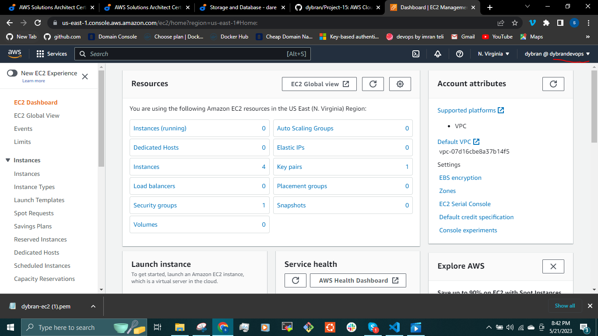

Go through the codes and make sure that all the variables are declared in the __vars.tf__ and __terraform.tfvars__.

We can now run the commands

`$ terraform init`

`$ terraform fmt`

`$ terraform valdiate`

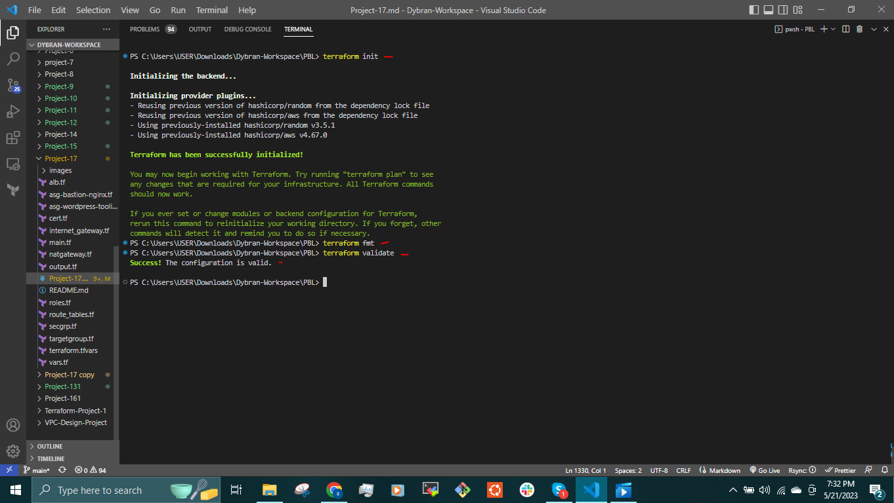

`$ terraform plan`

If everything is alright in the plan, we then create the resources by running the command

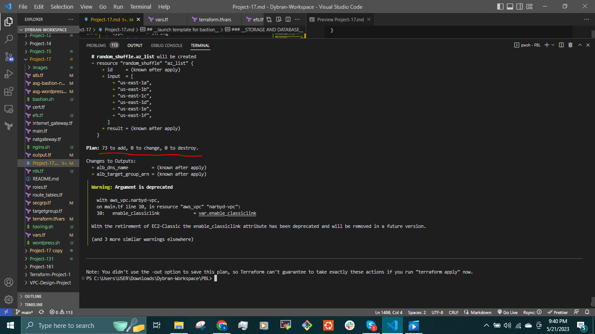

`$ terraform apply`

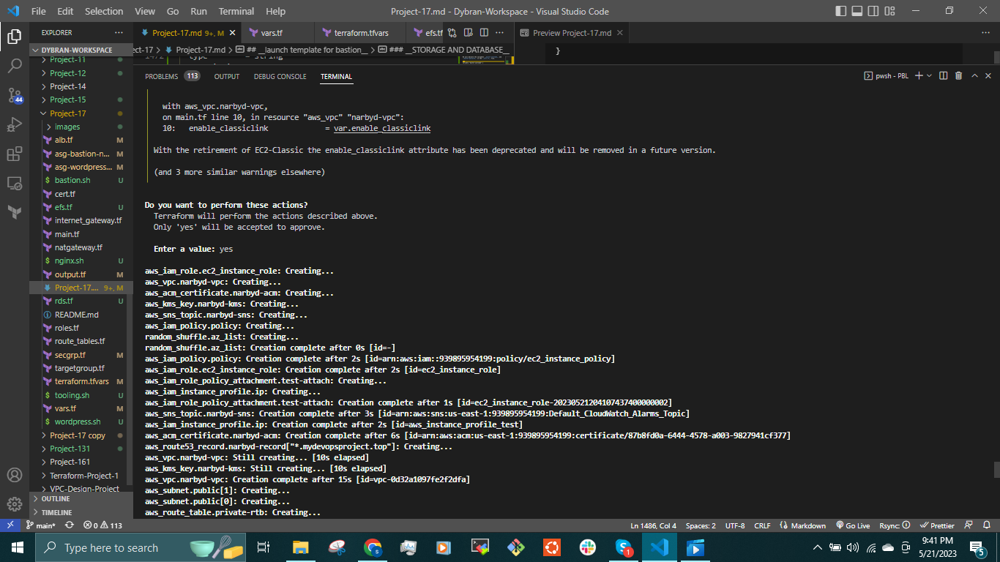

The __output.tf__ file displays the endpoint of the external load balancer

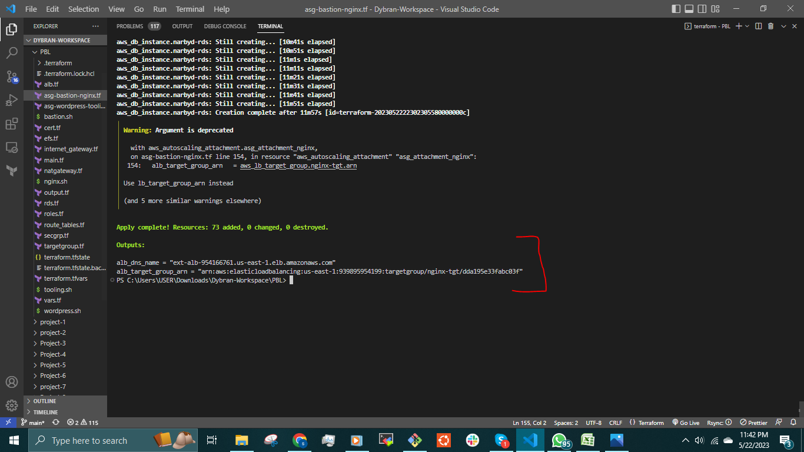

some of the resources created

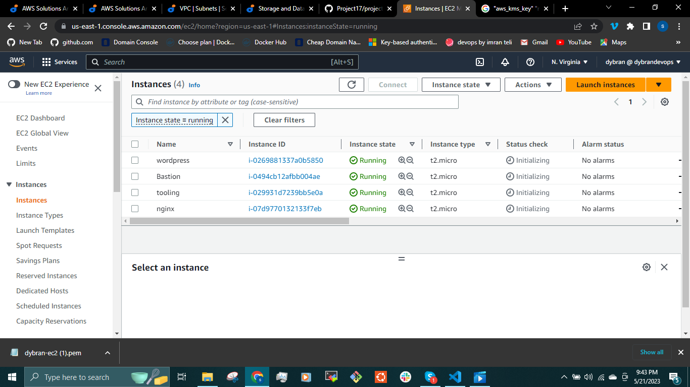
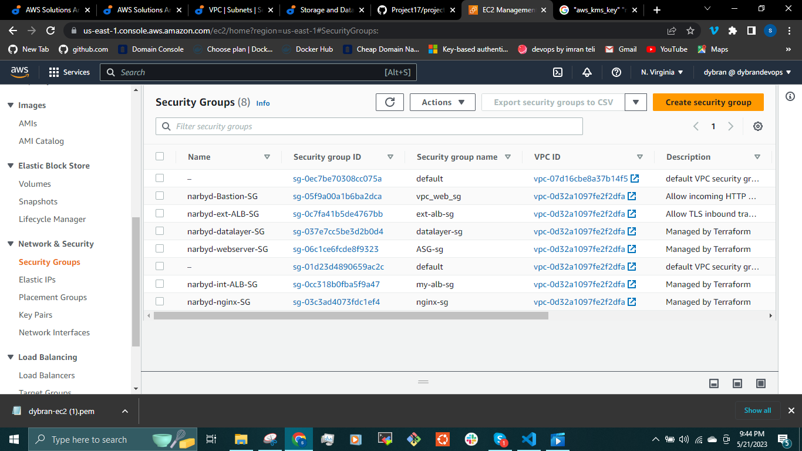
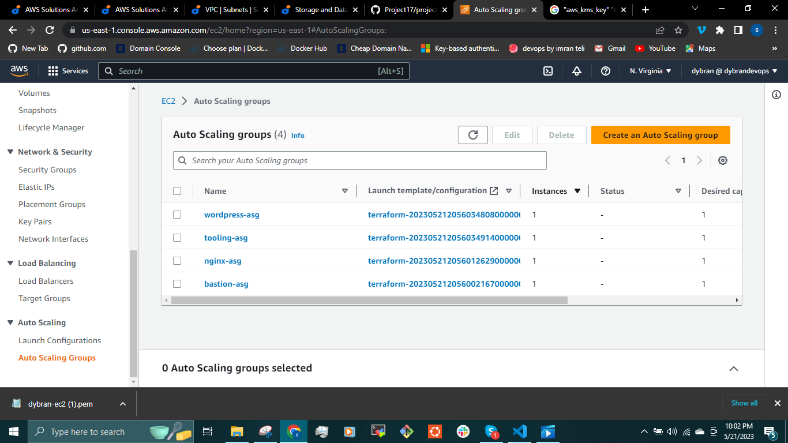
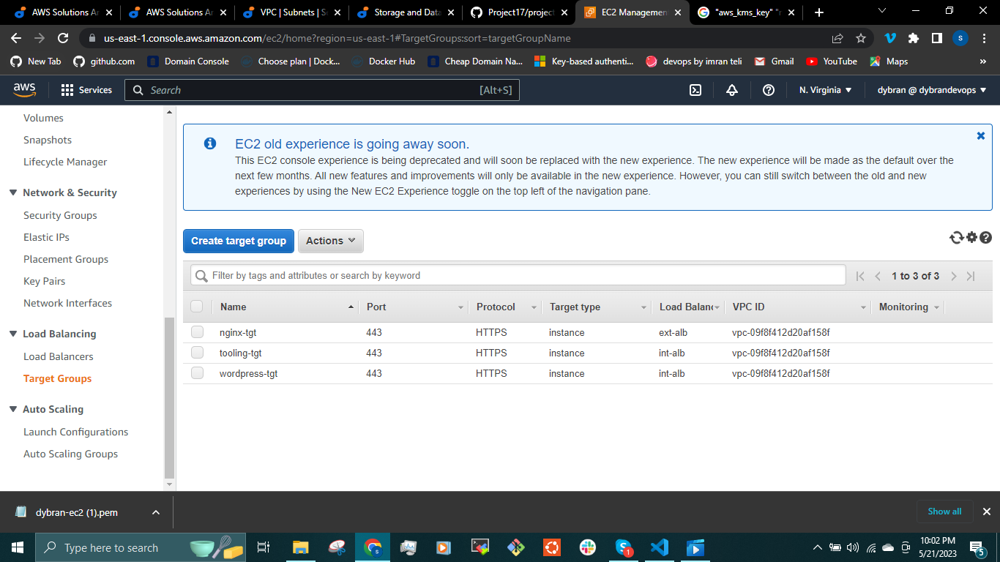
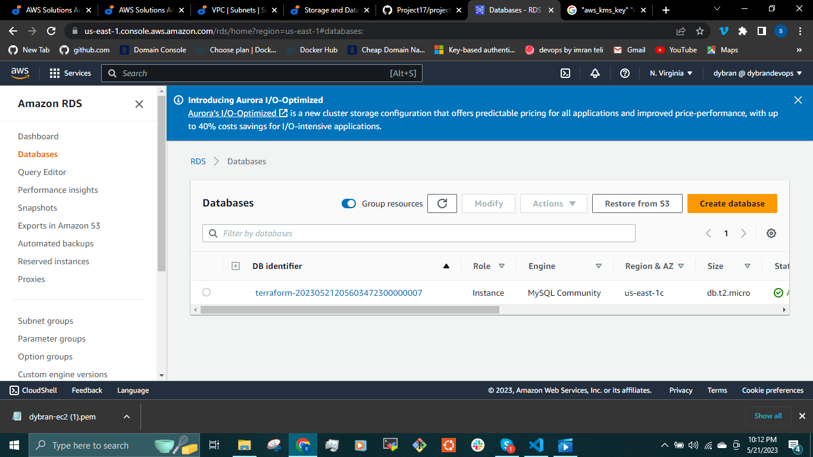

At this point, we have all infrastructure elements ready to be deployed automatically, but before we plan and apply our code we need to take note of two things.

- We have a long list of files which may looks confusing but we are going to fix this using the concepts of __modules__ in the next project.
- Our application wont work because in our shell script that was passed to launch, some endpoints like the __RDS__ and __EFS__ point is needed in which they have not been created yet. We will employ the use of __Ansible__ to fix this.
  
All these concepts will be implemented later on in this project. This project continues in [Project-18](https://github.com/dybran/Project-18/blob/main/Project-18.md).

__PROBLEM ENCOUNTERED:__

There was an error when trying to run __terraform plan__ . I opened the `$ ~/.aws/credentials` and figured that when configuring the AWS CLI, there was an extra space between the __=__ and the __accesskey__. This was fixed before running the `$ terraform plan` again.
